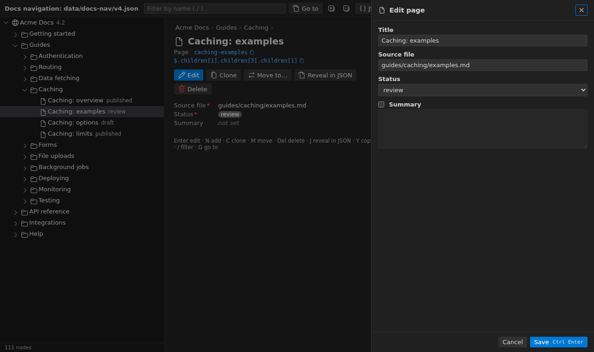
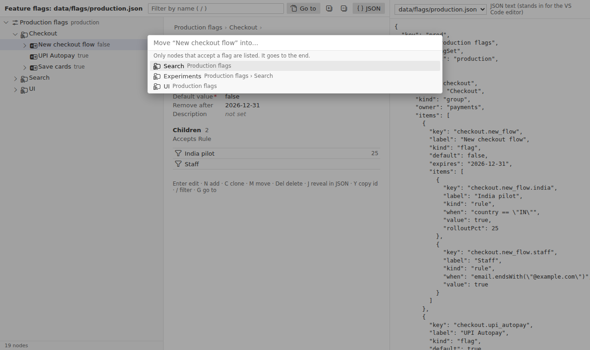

# Schema Tree Editor

Edit tree-shaped JSON (navigation menus, rule sets, feature flags, form layouts, content trees) as a **tree with forms**, while the JSON file stays the source of truth.

Node types come from **your TypeScript interfaces** or a **JSON Schema**. The tree only lets you nest what the types allow, and each node is edited in a form built from its type.



## Features

- **Two views of one file.** The tree edits the same document as the JSON editor. Undo, save, dirty state and Git diffs behave exactly as with hand edits. Edits are small, formatting-preserving text changes.
- **Find things fast.** Filter the tree (`/`), or jump anywhere with **Go to** (`G`) using words from the name, path, id or subtitle.
- **One node at a time.** Details are read-only until you press **Edit** (`Enter`). The slide-in form validates against the schema before saving.
- **Structure-aware.** Add, clone (`C`), drag, or **Move to…** (`M`) only where the schema allows that node type.
- **Text ↔ tree sync.** Moving the cursor in the JSON selects the node; **Reveal in JSON** (`J`) goes the other way.
- **Your key names.** `id`, `name`, `type` and `children` can be renamed per tree (e.g. `key`, `label`, `kind`, `items`).
- **Follows your VS Code theme.**



## Quick start

1. Add `schema-trees.json` at the root of your workspace:

   ```jsonc
   {
     "trees": [
       {
         "name": "docs-nav",
         "typesFile": "types/docs-nav.ts",   // TypeScript interfaces…
         "rootType": "SiteNode",
         "files": ["data/docs-nav/*.json"]
       },
       {
         "name": "flags",
         "schema": "schemas/flags.schema.json", // …or a hand-written JSON Schema
         "keys": { "id": "key", "name": "label", "type": "kind", "children": "items" },
         "files": ["data/flags/*.json"]
       }
     ]
   }
   ```

2. For TypeScript trees, `npm i -D ts-json-schema-generator`, then run **Schema Tree: Generate Schemas from TypeScript**. It writes `schemas/<name>.schema.json` and registers the schemas in `.vscode/settings.json`, so hand-editing gets validation and autocomplete too.
3. Open a matching JSON file and click the tree icon in the editor title (or **Reopen Editor With… → Schema Tree**).

## Writing the types

```ts
/**
 * @title Section
 * @treeIcon folder
 */
export interface SectionNode {
  id: string;
  /** @title Title */
  name: string;
  type: "section";                                  // literal type = node type
  /** @title Start collapsed */
  collapsed?: boolean;                              // optional = checkbox in the form
  children: (SectionNode | PageNode | LinkNode)[];  // what may be nested here
}
```

- A **node type** has an `id` and a literal `type`. A `name` is optional; the id is shown if there's none.
- `children: (A | B)[]` lists what may be nested. Leaf types have no `children`.
- `@title` sets the label. `@treeIcon` takes any [codicon](https://microsoft.github.io/vscode-codicons/dist/codicon.html) name. `@treeSubtitle field` shows that field in grey after the name.
- `@format textarea`, `@pattern`, `@minimum`, `@asType integer` and other JSDoc tags become form widgets and validation.

In a hand-written JSON Schema, use `"title"`, `"treeIcon"` and `"treeSubtitle"` on each node definition, `"const"` for the type, and `oneOf`/`anyOf` of `$ref`s in the children's `items`. See [`example/schemas/flags.schema.json`](example/schemas/flags.schema.json).

## Keys

| Key | Action |
| --- | --- |
| `Enter` / `E` | Edit node |
| `N` | Add child |
| `C` | Clone (with new ids) |
| `M` | Move to… |
| `Del` | Delete (`Ctrl+Z` undoes it) |
| `J` | Reveal in JSON |
| `Y` | Copy id |
| `/` | Filter |
| `G` | Go to |
| `Ctrl+Enter` | Save the form |

## CI

Fail the build when a generated schema is out of date:

Copy [`tools/gen-schemas.mjs`](tools/gen-schemas.mjs) into your repo, then:

```
node tools/gen-schemas.mjs --check
```

## Contributing

```
npm install
npm run build        # or: npm run watch, then F5 to launch the Extension Development Host on ./example
npm run preview      # dist-dev/preview.html: the editor UI in a browser, no VS Code needed
npm test             # unit tests, then integration tests in a downloaded VS Code
```

The code is small: `src/jsonOps.ts` (text edits), `src/model.ts` (schema → node types), `src/provider.ts` (VS Code bridge), `webview/main.js` (the `<tree-editor>` element). Built with [Wunderbaum](https://github.com/mar10/wunderbaum), [json-editor](https://github.com/json-editor/json-editor), [jsonc-parser](https://github.com/microsoft/node-jsonc-parser) and [codicons](https://github.com/microsoft/vscode-codicons).

## License

MIT
